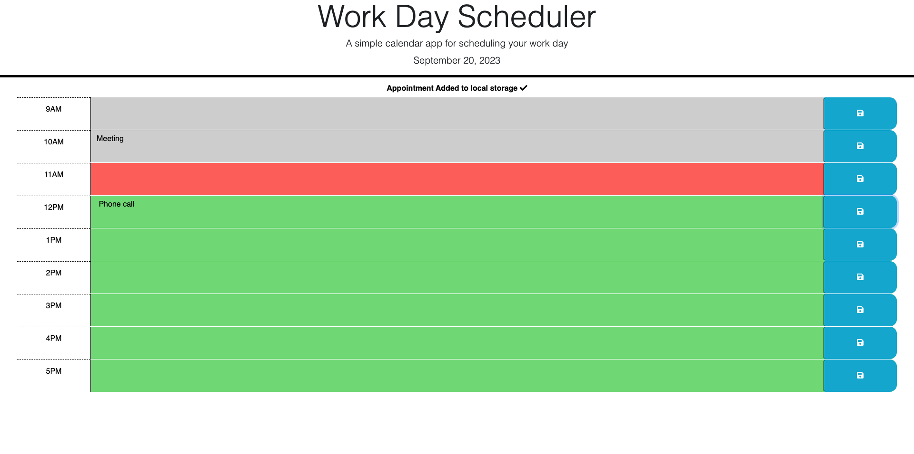

# WorkDayScheduler

## Description

WorkDayScheduler is a web-based daily planner application designed for employees with busy schedules. It allows users to efficiently manage their time by adding important events to a daily planner during standard business hours from 9am to 5pm.

- **Motivation**: In today's fast-paced work environment, managing time effectively is crucial. This application provides a simple yet effective tool for employees to plan out their workday.
- **Purpose**: The WorkDayScheduler serves as a digital assistant, helping users keep track of their daily tasks and appointments.
- **Problem it Solves**: It offers a structured platform for users to jot down their tasks for the day, ensuring they don't miss out on any important events or meetings.
- **What I Learned**: Developing this application enhanced my understanding of JavaScript libraries like jQuery and Day.js. I also gained experience in utilizing local storage to retain user inputs even after page refreshes.

## Installation

To utilize the WorkDayScheduler, simply visit the deployed website. For a local version, clone the repository and open the `index.html` file in your preferred web browser.

## Usage

Experience the WorkDayScheduler firsthand here: [WorkDayScheduler](https://isaacmasterman.github.io/M05C-WorkDayScheduler/)

Below is a snapshot of the application in action:

## Credits

- The `reset.css` was sourced from the Week 2 Day 3 materials of the EdX Coding Bootcamp Course.

## License

This project is protected under the MIT License.
